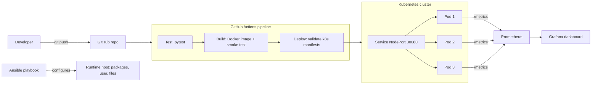

# DevOps CA-2: Notes Service

A tiny Flask REST service taken through a full DevOps lifecycle: CI/CD, configuration management, containers and Kubernetes, and monitoring.

## Architecture



## Repository layout

| Path | Step | Purpose |
|---|---|---|
| `app/` | - | Flask service (`/health`, `/version`, `/notes`, `/metrics`, `/boom`) and pytest tests |
| `.github/workflows/ci.yml` | 1 | GitHub Actions pipeline: test, build, deploy |
| `.gitlab-ci.yml` | Bonus | GitLab pipeline for the hackathon |
| `ansible/` | 2 | `playbook.yml` and `inventory.ini` |
| `Dockerfile`, `k8s/` | 3 | Container image and Kubernetes Deployment + Service |
| `monitoring/` | 4 | Prometheus + Grafana via docker-compose |

## Step 1: Pipeline (GitHub Actions)

Push to `main` and open the **Actions** tab. Three jobs run in order: `test`, `build`, `deploy`. Screenshot the green run for the submission. The pipeline diagram is the "Architecture" chart above (export it as an image from GitHub's rendered README).

## Step 2: Ansible

```bash
cd ansible
ansible-playbook -i inventory.ini playbook.yml --ask-become-pass
```

Installs packages, creates the `notesapp` user, copies the app, and writes a `.env` file. Run a syntax check first with `ansible-playbook -i inventory.ini playbook.yml --syntax-check`. Needs a Debian/Ubuntu target (it uses `apt`).

## Step 3: Docker and Kubernetes

```bash
docker build -t notes-service:1.0.0 .
minikube start            # or: kind create cluster
minikube image load notes-service:1.0.0     # kind: kind load docker-image notes-service:1.0.0
kubectl apply -f k8s/
kubectl get pods
```

**Rolling update:**

```bash
docker tag notes-service:1.0.0 notes-service:2.0.0   # version shown by /version comes from APP_VERSION
minikube image load notes-service:2.0.0
kubectl set image deployment/notes-service notes-service=notes-service:2.0.0
kubectl set env deployment/notes-service APP_VERSION=2.0.0
kubectl rollout status deployment/notes-service
kubectl get pods
```

**Rollback:**

```bash
kubectl rollout history deployment/notes-service
kubectl rollout undo deployment/notes-service
kubectl rollout status deployment/notes-service
```

Screenshot `kubectl get pods` before, during and after each, plus the `rollout status` output.

## Step 4: Monitoring

```bash
cd monitoring
docker compose up --build -d
```

- App: http://localhost:5000
- Prometheus: http://localhost:9090 (check Status > Targets shows `notes-service` UP)
- Grafana: http://localhost:3000 (login `admin` / `admin`; the Prometheus data source is already added)

Generate traffic so the panels have data:

```bash
for i in $(seq 1 200); do curl -s localhost:5000/health >/dev/null; curl -s localhost:5000/boom >/dev/null; done
```

In Grafana create a dashboard with these panels (Prometheus queries):

| Panel | Query |
|---|---|
| Uptime | `up{job="notes-service"}` |
| Request rate | `sum(rate(http_requests_total[1m]))` |
| Latency p95 | `histogram_quantile(0.95, sum(rate(http_request_duration_seconds_bucket[1m])) by (le))` |
| Error rate % | `100 * sum(rate(http_requests_total{status=~"5.."}[1m])) / sum(rate(http_requests_total[1m]))` |

## Step 5: Report

Slides (4-5): architecture, pipeline flow, challenges, lessons learned. Write the challenges section from what actually went wrong while you ran the steps above.

## Step 6 (Bonus): External challenge

- Event: Life After Code, the GitLab Transcend Hackathon on Devpost (deadline Oct 27, 2026)
- Devpost registration: _add screenshot_
- GitLab contributor onboarding: _add screenshot_
- Status: _registered / project in progress / submitted (add submission link)_
