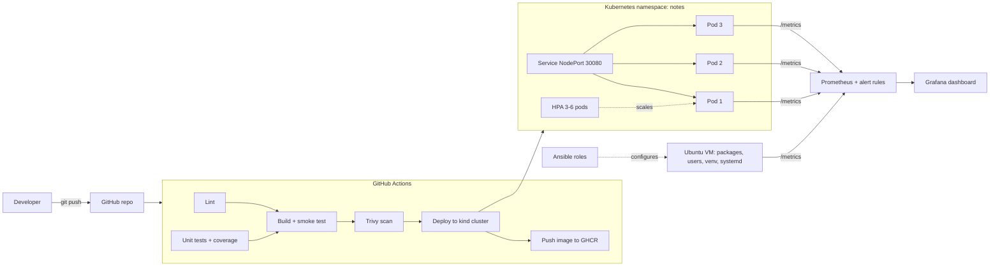

# DevOps CA-2: Notes Service

A small Flask REST service taken through the full DevOps lifecycle: CI/CD, configuration management, containers and Kubernetes, monitoring, and an external hackathon.

| Step | What | Where |
|---|---|---|
| 1 | GitHub Actions pipeline: lint, test, build, scan, deploy to Kubernetes, publish | [.github/workflows/ci.yml](.github/workflows/ci.yml), [docs/REPORT.md](docs/REPORT.md#2-pipeline-flow) |
| 2 | Ansible roles: packages, users, files, virtualenv, systemd service, health check | [ansible/](ansible/) |
| 3 | Multi-stage Docker image, Kubernetes manifests, rolling update and rollback demo | [Dockerfile](Dockerfile), [k8s/](k8s/), [scripts/k8s-rollout-demo.sh](scripts/k8s-rollout-demo.sh) |
| 4 | Prometheus, alert rules, and an auto-provisioned Grafana dashboard | [monitoring/](monitoring/) |
| 5 | Report: architecture, pipeline flow, challenges, lessons learned | [docs/REPORT.md](docs/REPORT.md) |
| 6 | GitLab Transcend hackathon (Devpost) | [.gitlab-ci.yml](.gitlab-ci.yml), [docs/HACKATHON.md](docs/HACKATHON.md) |

## Architecture



## The service

| Endpoint | Purpose |
|---|---|
| `GET /health` | Liveness: the process is up (returns uptime) |
| `GET /ready` | Readiness: the pod can take traffic. Returns 503 when `FAIL_READINESS=true`, which the rollback demo uses |
| `GET /version` | Version, set at build time with `--build-arg APP_VERSION=...` |
| `GET/POST /notes`, `DELETE /notes/<id>` | The actual API |
| `GET /metrics` | Prometheus metrics: request count, latency histogram, in-flight requests, `app_info`, start time |
| `GET /boom`, `GET /slow` | Deliberate 500 and slow response, so the dashboard has errors and latency to show |

Every request writes a JSON log line with a request ID, which is echoed back in the `X-Request-ID` header.

Run locally:

```bash
pip install -r app/requirements-dev.txt
cd app && python -m pytest -v --cov=main
python main.py
```

## Step 1: CI/CD pipeline (GitHub Actions)

Push to `main` and open the **Actions** tab.

| Job | What it does |
|---|---|
| `lint` | ruff, hadolint, yamllint, `ansible-playbook --syntax-check`, ansible-lint, kubeconform |
| `test` | pytest with coverage (fails under 85%), JUnit and coverage reports uploaded as artifacts |
| `build` | Builds the image tagged `1.0.<run number>`, runs it, and smoke-tests every endpoint |
| `scan` | Trivy scans the image for CVEs and the Dockerfile and manifests for misconfigurations |
| `deploy` | Spins up a real kind cluster, applies `k8s/`, waits for the rollout, **rolls back automatically if it fails**, smoke-tests through the Service |
| `publish` | On `main` only: pushes the image to `ghcr.io/<owner>/notes-service` |

Screenshot the green run graph for the submission. The pipeline diagram is in [docs/REPORT.md](docs/REPORT.md#2-pipeline-flow).

## Step 2: Ansible

```text
ansible/
├── ansible.cfg
├── inventory.ini
├── group_vars/app_servers.yml     # app version, port, admin users
├── playbook.yml
├── test-in-docker.sh              # runs the playbook twice in Ubuntu 24.04 to prove idempotency
└── roles/
    ├── common/                    # apt packages, timezone, admin users, motd
    └── notes_app/                 # app user, dirs, code, .env, venv, logrotate, systemd unit, health check
```

```bash
cd ansible
ansible-playbook playbook.yml --syntax-check
ansible-playbook playbook.yml --check --diff    # dry run
ansible-playbook playbook.yml                   # apply
ansible-playbook playbook.yml --tags app        # redeploy only the app
```

The easiest way to test it end to end (needs Docker only):

```bash
./ansible/test-in-docker.sh
```

It installs Ansible in an Ubuntu container, runs the playbook twice, checks the second run reports `changed=0`, and curls the running app. On a real VM the app runs as a hardened systemd unit. Inside a container (no systemd) it falls back to a gunicorn daemon. The playbook finishes by checking `/health` and confirming `/version` matches `app_version`.

## Step 3: Docker and Kubernetes

The image is multi-stage, runs as UID 10001, and contains no test files or build tools.

```bash
docker build --build-arg APP_VERSION=1.0.0 -t notes-service:1.0.0 .
docker run -p 5000:5000 notes-service:1.0.0
```

Manifests in `k8s/` (applied with `kubectl apply -k k8s/` into the `notes` namespace):

| File | Purpose |
|---|---|
| `deployment.yaml` | 3 replicas, `maxSurge: 1`, `maxUnavailable: 0`, readiness/liveness probes, `progressDeadlineSeconds: 60`, non-root, read-only root filesystem, resource limits |
| `service.yaml` | NodePort 30080 |
| `configmap.yaml` | `LOG_LEVEL`, `MAX_NOTE_LENGTH` |
| `hpa.yaml` | Scales 3 to 6 pods at 70% CPU (needs metrics-server) |
| `pdb.yaml` | Keeps at least 2 pods up during node drains |

**Rolling update and rollback demo**, all in one script:

```bash
minikube start
CLUSTER=minikube ./scripts/k8s-rollout-demo.sh     # or CLUSTER=kind / CLUSTER=docker-desktop
```

It pauses at each stage so you can screenshot:

1. Deploys 1.0.0 and curls `/version`.
2. Rolling update to 2.0.0: watch pods replaced one at a time with no downtime.
3. Pushes a **broken release** (readiness fails). The rollout stalls, and because `maxUnavailable: 0` the old pods keep serving traffic.
4. Shows `rollout history` (with change-cause annotations), runs `rollout undo`, and confirms the service is healthy again.

Open the service in a browser with `minikube service notes-service -n notes`.

## Step 4: Monitoring

```bash
cd monitoring
docker compose up --build -d
../scripts/generate-traffic.sh http://localhost:5000 180
```

| URL | What to show |
|---|---|
| http://localhost:5000 | The app |
| http://localhost:9090/targets | `notes-service` target is UP |
| http://localhost:9090/alerts | `NotesServiceDown`, `HighErrorRate`, `HighLatencyP95` rules (HighErrorRate fires under the traffic script) |
| http://localhost:3000 | Grafana (`admin` / `admin`). The **Notes Service - Overview** dashboard opens as the home page |

The dashboard is provisioned from [monitoring/grafana/dashboards/notes-service.json](monitoring/grafana/dashboards/notes-service.json), so nothing needs to be built by hand:

- Stats: service status (UP/DOWN), process uptime, 24h availability, error rate, p95 latency, app version
- Graphs: request rate by endpoint, requests by status code, p50/p95/p99 latency, error rate over time, average latency per endpoint, in-flight requests and notes stored
- Table: currently firing alerts

To show the uptime panel turning red: `docker stop notes-service`, wait 30s (the `NotesServiceDown` alert fires too), then `docker start notes-service`.

Logs: `docker logs -f notes-service` shows one JSON line per request.

## Step 5: Report and slides

[docs/REPORT.md](docs/REPORT.md) has the architecture, pipeline flow, challenges, and lessons learned. The slides follow the same sections.

## Step 6 (Bonus): External challenge

See [docs/HACKATHON.md](docs/HACKATHON.md).

## Screenshot checklist

- [ ] GitHub Actions run graph, all jobs green
- [ ] `deploy` job log showing `rollout status` and `rollout history`
- [ ] Ansible run 1 (`changed=N`) and run 2 (`changed=0`)
- [ ] `kubectl get pods` before, during and after the rolling update
- [ ] Failed rollout of the broken release, then `rollout undo` and history
- [ ] Prometheus targets page (UP) and alerts page
- [ ] Grafana dashboard with traffic, plus one with the service DOWN
- [ ] Devpost registration / submission page
