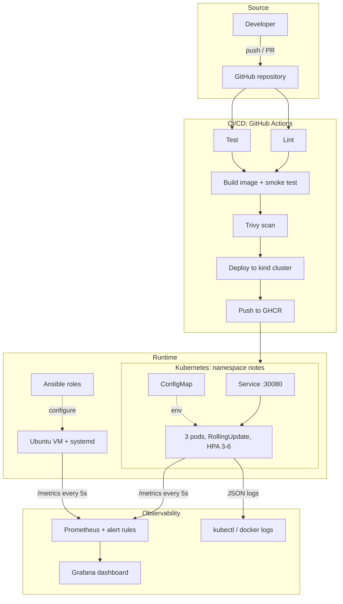
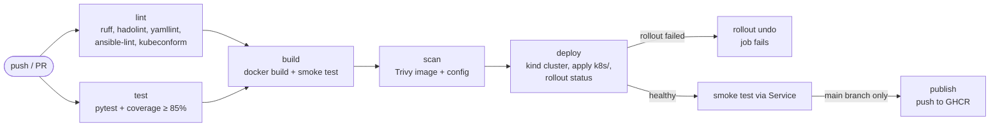

# DevOps CA-2 Report: Notes Service

_Team: add names and PRNs_

## 1. Architecture

| Layer | Tool | Why |
|---|---|---|
| Application | Python Flask + gunicorn | Small enough to focus on the pipeline, real enough to have metrics and failures |
| CI/CD | GitHub Actions | Free for public repos, lives next to the code, and can run a real Kubernetes cluster (kind) inside the job |
| Configuration management | Ansible (roles) | Agentless (only SSH), YAML, idempotent |
| Containers | Docker (multi-stage) | Small, non-root runtime image |
| Orchestration | Kubernetes (minikube / kind) | Rolling updates, self-healing, autoscaling |
| Monitoring | Prometheus + Grafana | Pull-based metrics, PromQL, dashboards as code |

## 2. Pipeline flow

- `lint` and `test` run in parallel. Everything after them runs only if both pass.
- The image is built once, saved as an artifact, and the same image is scanned, deployed and published. What was tested is exactly what ships.
- The version is `1.0.<run number>`, baked into the image and checked by the smoke test, so every deployment is traceable to a pipeline run.
- Deploy annotates the Deployment with the run number and commit SHA, so `kubectl rollout history` shows where each revision came from.
- If the rollout does not become healthy within 120s, the pipeline runs `kubectl rollout undo` and fails.

## 3. Rolling update and rollback

| Setting | Value | Effect |
|---|---|---|
| `maxSurge` | 1 | One extra pod is started before an old one is removed |
| `maxUnavailable` | 0 | Capacity never drops below 3 ready pods |
| `readinessProbe` | `/ready` | A new pod gets traffic only when it says it is ready |
| `progressDeadlineSeconds` | 60 | A stuck rollout is reported as failed instead of hanging forever |
| `preStop: sleep 5` | | Pods stop receiving traffic before they shut down, so no requests are dropped |

The broken-release demo shows why these matter: the bad pod never becomes ready, the rollout stalls, and users keep getting answers from the old pods until `rollout undo` restores the previous ReplicaSet.

## 4. Monitoring

| Signal | Metric / query |
|---|---|
| Uptime | `up{job="notes-service"}`, `time() - app_start_time_seconds`, `avg_over_time(up[24h])` |
| Traffic | `sum by (endpoint) (rate(http_requests_total[1m]))` |
| Latency | `histogram_quantile(0.95, sum(rate(http_request_duration_seconds_bucket[1m])) by (le))` |
| Errors | `100 * sum(rate(http_requests_total{status=~"5.."}[1m])) / sum(rate(http_requests_total[1m]))` |
| Saturation | `http_requests_in_progress` |

Alert rules: service down for 30s, error rate above 5% for 1 minute, p95 latency above 500ms for 1 minute.

## 5. Challenges

_Edit this list to match what actually happened to your team._

| Challenge | What happened | Fix |
|---|---|---|
| Interactive `tzdata` prompt | `apt install` inside the Ubuntu test container stopped to ask for a time zone | Set `DEBIAN_FRONTEND=noninteractive` and `TZ`, and manage the time zone in the `common` role |
| PEP 668 "externally managed environment" | Ubuntu 24.04 blocks `pip install` into the system Python; the first playbook used `--break-system-packages` | Install dependencies into a virtualenv owned by the app user |
| Inconsistent metrics | With 2 gunicorn workers, each process kept its own counters, so Prometheus saw totals jump up and down | Run 1 worker with 4 threads (or use prometheus_client multiprocess mode) |
| Local images in Kubernetes | Pods were stuck in `ErrImagePull` because minikube cannot see images built on the host | `minikube image load` / `kind load docker-image` and `imagePullPolicy: IfNotPresent` |
| No systemd in containers | Testing the playbook in Docker meant `systemctl` was unavailable | The role checks `ansible_service_mgr` and starts a gunicorn daemon instead |
| Windows line endings | Scripts edited on Windows failed in Linux containers with `bad interpreter` | `.gitattributes` forces LF |
| Readiness vs liveness | Using `/health` for both meant a pod that could not serve traffic was still sent requests | Separate `/ready` endpoint for readiness |

## 6. Lessons learned

1. **Build once, deploy the same artifact.** Rebuilding per stage means you test one image and ship another.
2. **Idempotency is testable.** Running the playbook twice and checking `changed=0` catches tasks that are not really declarative.
3. **Rollback is a design choice, not a command.** `rollout undo` only saves you if probes, `maxUnavailable: 0` and a progress deadline stop a bad release from taking down the old pods first.
4. **Instrument before you need it.** The four golden signals (latency, traffic, errors, saturation) took about 20 lines of code and made every later demo measurable.
5. **Everything as code.** Pipeline, server config, cluster state, dashboards and alerts are all files in the repo and are reviewed like code.
6. **Shift security left.** Linting, image scanning and a non-root, read-only container cost almost nothing in the pipeline and are hard to bolt on later.

## 7. Slide outline (4-5 slides)

1. **Architecture**: diagram from section 1 and the tool table.
2. **Pipeline flow**: diagram from section 2 plus a screenshot of the green Actions run.
3. **Kubernetes and monitoring**: rolling update / rollback screenshots and the Grafana dashboard.
4. **Challenges**: the top 3-4 rows from section 5.
5. **Lessons learned and hackathon**: section 6 and the Devpost submission.
